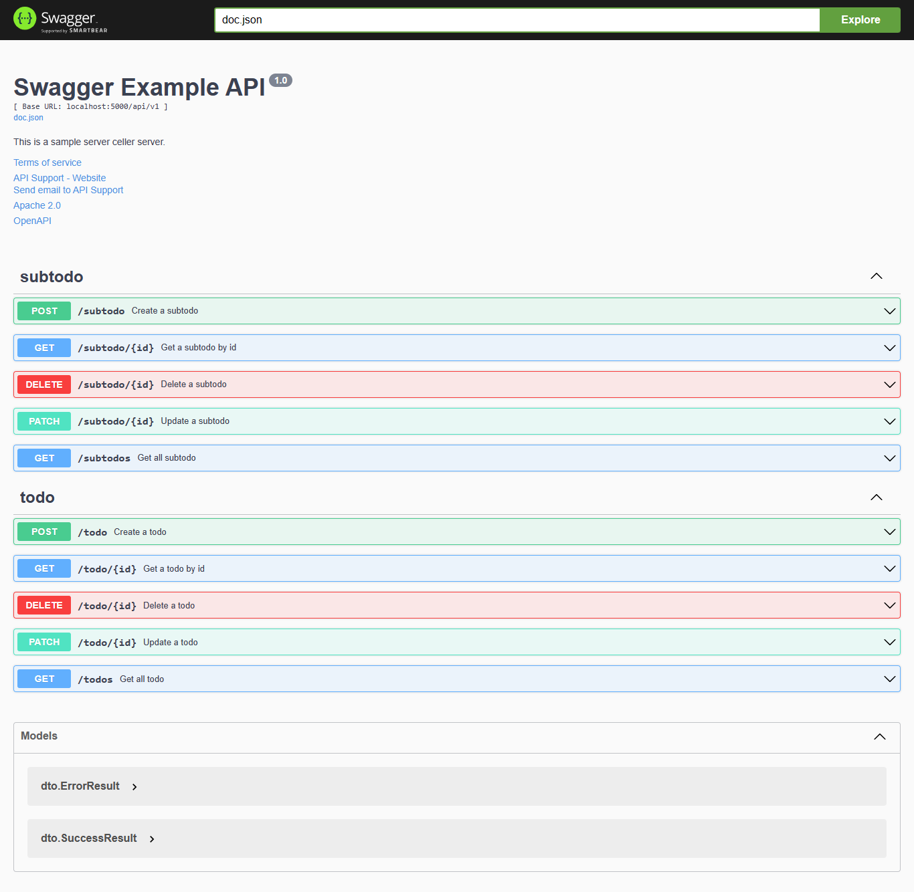
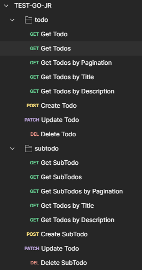

## TEST GO JR

### PREQUISITES:
- go v.120 or latest
- git / git bash (windows)
- postgresql (pg admin)


### HOW TO USE?
```
git clone https://github.com/thxrhmn/test-go-jr.git
cd test-go-jr
go get
```

```
cp .env_example .env
```
Open the `.env` file and you can change `DB_NAME`, `DB_USER`, `DB_PASSWORD`, `DB_HOST`, and `DB_PORT` or you can adjust to what I wrote below. `SECRET_KEY` and `PORT` do not need to be changed. Make sure everything matches your PostgreSQL database settings.

```
SECRET_KEY=rahman
PORT=5000
DB_NAME=todolist
DB_USER=postgres
DB_HOST=localhost
DB_PASSWORD=root
DB_PORT=5432
```

### RUN 
```
go run main.go
```

### ADD EXAMPLE DATA
example data will be automatically added to database
```
chmod +x example-data.sh
./example-data.sh
```
### SWAGGER
open this link in your browser http://localhost:5000/swagger/index.html#/
you can test all enpoints using swagger



### POSTMAN COLLECTION
or you can use my postman collection https://www.postman.com/docking-module-geologist-95497667/workspace/thxrhmn/collection/26563934-d1466f86-f29e-4729-8f53-647e6128f234?action=share&creator=26563934

